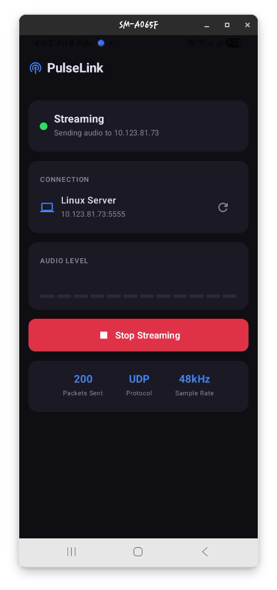
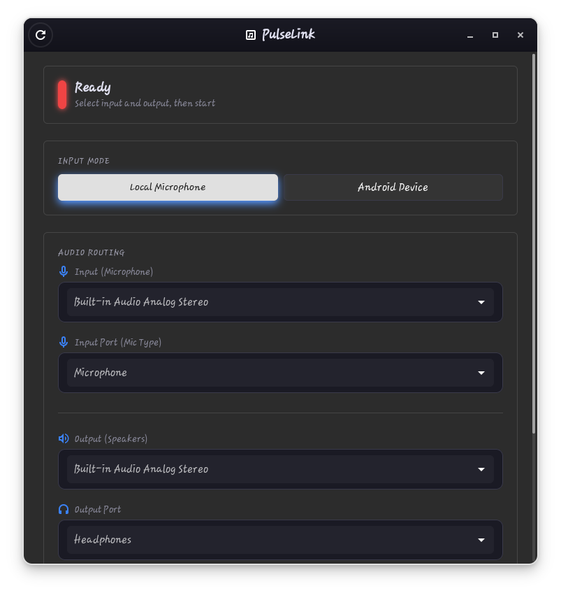
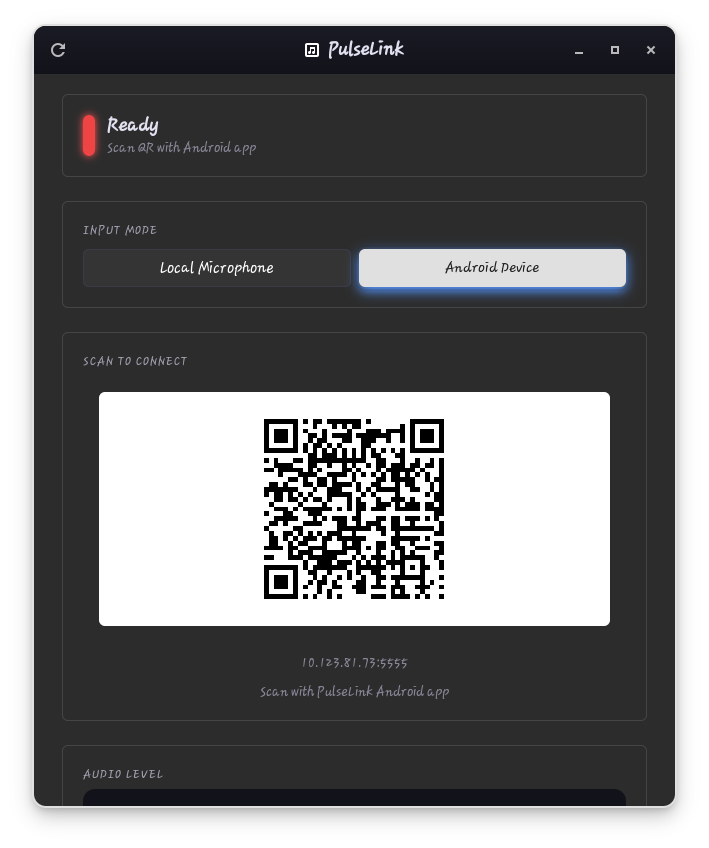

# PulseLink

PulseLink is an audio streaming application that allows you to transmit audio between your Android phone and Linux computer. It supports two main modes: streaming audio from your Android phone to your Linux speakers, and routing your laptop microphone to the speakers.

> **Known Limitation:** When using the Local Audio feature with headphones connected, the audio will currently not output through your laptop speakers. We are actively investigating solutions for this hardware-level limitation and will update the app once resolved.





## Features

**Android to Linux Streaming**
- Stream microphone audio from your Android phone to your Linux computer over WiFi
- Low-latency UDP audio transmission
- Audio level visualization on both devices
- Automatic server discovery via QR code scanning

**Local Audio Routing**
- Route your laptop microphone directly to speakers
- Force speakers to output audio even when headphones are connected
- ALSA-level control to bypass PulseAudio port restrictions
- Useful for testing microphones or creating a local PA system

## Requirements

**Android**
- Android 7.0 (API 24) or higher
- Microphone permission
- Camera permission (for QR code scanning)
- WiFi connection to the same network as your Linux computer

**Linux**
- Python 3.10 or higher
- GTK 4
- PipeWire or PulseAudio
- The following Python packages: PyGObject, pulsectl, sounddevice, numpy, scipy
- ALSA utilities (amixer) for speaker control

## Installation

### Android

Download the APK from the Releases page or build from source:

```bash
./gradlew assembleRelease
```

The APK will be in `app/build/outputs/apk/release/`.

### Linux

**Option 1: Run from source**

```bash
cd Linux
python3 -m venv venv
source venv/bin/activate
pip install -r requirements.txt
python main.py
```

**Option 2: AppImage**

Download the AppImage from the Releases page, make it executable, and run:

```bash
chmod +x PulseLink-*.AppImage
./PulseLink-*.AppImage
```

The AppImage uses your system's Python and GTK4 libraries. If you get import errors, install the required dependencies:

```bash
# Install system dependencies (Ubuntu/Debian)
sudo apt install python3-gi python3-gi-cairo gir1.2-gtk-4.0 gir1.2-adw-1 libportaudio2

# Install Python packages
pip3 install --user pulsectl sounddevice numpy scipy qrcode Pillow netifaces
```

## Usage

### Android to Linux Audio Streaming

1. Start the Linux application and select "Android Device" mode
2. Click "Start Server" to begin listening for connections
3. Note the IP address displayed or scan the QR code with your Android phone
4. On your Android phone, open PulseLink and tap "Scan QR Code"
5. Grant microphone permission when prompted
6. Start streaming - audio from your phone microphone will play through your Linux speakers

### Local Microphone to Speakers

1. Start the Linux application
2. Select "Local Microphone" mode
3. Choose your input device (microphone) from the dropdown
4. Choose your output device (speakers) from the dropdown
5. If you want to use speakers while headphones are connected:
   - Check "Force Speakers On"
   - Check "Mute Headphones"
6. Click "Start Audio"

## Building from Source

### Android

Requires Android Studio or the Android SDK with Gradle.

```bash
# Debug build
./gradlew assembleDebug

# Release build
./gradlew assembleRelease
```

### Linux AppImage

Requires PyInstaller and appimagetool.

```bash
cd Linux
pip install pyinstaller
pyinstaller --onefile --name pulselink --add-data "style.css:." main.py

# Then use appimagetool to create the AppImage
```

## Project Structure

```
PulseLink/
├── app/                    # Android application source
│   └── src/main/java/     # Kotlin source files
├── Linux/                  # Linux application source
│   ├── main.py            # Application entry point
│   ├── server.py          # UDP audio server
│   ├── local_audio.py     # Local microphone routing
│   ├── ui/                # GTK 4 user interface
│   └── style.css          # Application styling
├── .github/workflows/      # CI/CD configuration
└── README.md
```

## Technical Details

**Audio Format**
- Sample rate: 48000 Hz
- Channels: Mono
- Bit depth: 16-bit signed little-endian PCM
- Frame size: 960 samples (20ms)

**Network Protocol**
- UDP for audio data transmission
- Packet format: 4-byte sequence number followed by raw PCM audio data
- Default port: 5555

## Troubleshooting

**No audio playing on Linux**
- Check that your audio output device is selected correctly
- Verify that PipeWire or PulseAudio is running
- Try a different output device in the dropdown

**Speakers unavailable when headphones connected**
- Enable "Force Speakers On" checkbox
- This disables ALSA auto-mute and directly enables the speaker channel

**High latency or audio stuttering**
- Ensure both devices are on the same WiFi network
- Reduce distance between devices and router
- Close other network-intensive applications

**Connection issues**
- Verify both devices are on the same network
- Check that port 5555 is not blocked by a firewall
- Try restarting the server on the Linux side

## License

This project is open source. See the LICENSE file for details.

## Contributing

Contributions are welcome. Please open an issue or submit a pull request on GitHub.

## Developer

This project is developed by Uzair Developer. [GitHub](https://github.com/uzairdeveloper223)