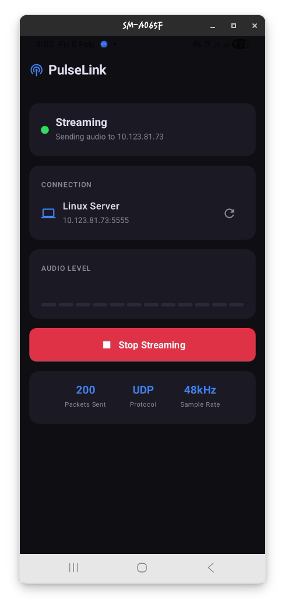
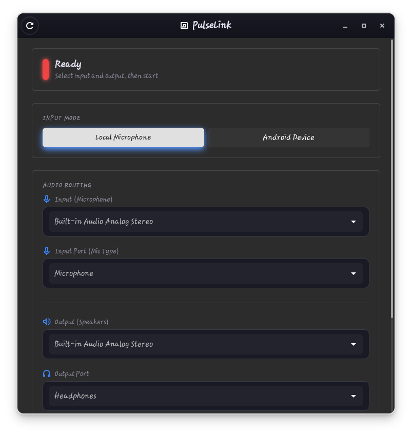
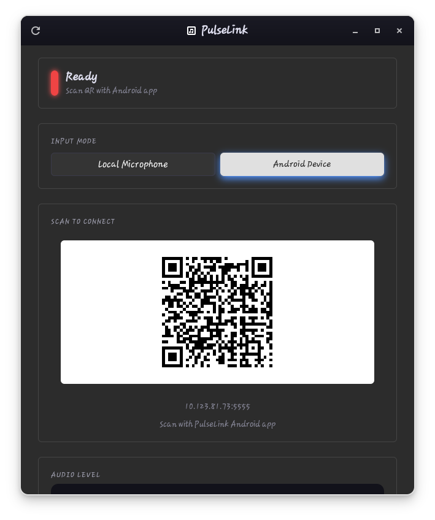

# PulseLink

PulseLink is an audio streaming application that allows you to transmit audio between your Android phone and Linux computer. It supports two main modes: streaming audio from your Android phone to your Linux speakers, and routing your laptop microphone to the speakers.

> **Hardware Limitation Notice (ThinkPad X390 & Others):** The 3.5mm combo jack on many laptops (including ThinkPad X390) uses a normally-closed mechanical switch. When a plug is inserted (even a mic-only one sometimes), this switch physically disconnects the internal speaker amplifier at the PCB level to prevent audio leakage. Because this mute is mechanical—not controlled by any software register, GPIO pin, or codec verb—it is physically impossible to force the laptop speakers on while the combo jack is occupied.
>
> **Solution:** To use the local PA/microphone routing feature while saving your laptop speakers, use a **USB Microphone** (or a cheap $5 USB Audio Adapter). The 3.5mm jack remains empty, so the speakers stay physically connected, and the app will natively bridge the USB mic input directly to your laptop speakers in real-time.





## Features

**Android to Linux Streaming**
- Stream microphone audio from your Android phone to your Linux computer over WiFi
- Low-latency UDP audio transmission
- Audio level visualization on both devices
- Automatic server discovery via QR code scanning

**Local Audio Routing**
- Route audio from any input source exactly to any output sink using PipeWire
- Hardware-native loops enable nearly zero-latency voice passthrough
- Use your laptop as a live concert PA system using a USB mic or Bluetooth headset
- Useful for testing microphones or creating a local PA system

## Requirements

**Android**
- Android 7.0 (API 24) or higher
- Microphone permission
- Camera permission (for QR code scanning)
- WiFi connection to the same network as your Linux computer

**Linux**
- Python 3.10 or higher
- GTK 4
- PipeWire or PulseAudio
- The following Python packages: PyGObject, pulsectl, sounddevice, numpy, scipy
- ALSA utilities (amixer) for speaker control

## Installation

### Android

Download the APK from the [Releases](https://github.com/uzairdeveloper223/PulseLink/releases/latest) page or build from source:

```bash
./gradlew assembleRelease
```

The APK will be in `app/build/outputs/apk/release/`.

### Linux

**Option 1: Run from source**

```bash
cd Linux
sudo apt install python3-venv
python3 -m venv venv
source venv/bin/activate
pip install -r requirements.txt
python main.py
```

**Option 2: AppImage**

Download the AppImage from the Releases page, make it executable, and run:

```bash
sudo apt install python3-venv
chmod +x PulseLink-*.AppImage
./PulseLink-*.AppImage
```

On first run, the app will prompt you to install Python dependencies. This creates a local environment in `~/.config/pulselink/` and only needs to be done once.

**System Requirements:**
- GTK4 and libadwaita must be installed:
  ```bash
  sudo apt install python3-gi python3-gi-cairo gir1.2-gtk-4.0 gir1.2-adw-1 libportaudio2
  ```

## Usage

### Android to Linux Audio Streaming

1. Start the Linux application and select "Android Device" mode
2. Click "Start Server" to begin listening for connections
3. Note the IP address displayed or scan the QR code with your Android phone
4. On your Android phone, open PulseLink and tap "Scan QR Code"
5. Grant microphone permission when prompted
6. Start streaming - audio from your phone microphone will play through your Linux speakers

### Local Microphone to Speakers

1. Start the Linux application
2. Select "Local Microphone" mode
3. Choose your input device (microphone) from the dropdown
4. Choose your output device (speakers) from the dropdown
5. If using a standalone microphone and want to output to laptop speakers:
   - **Important:** If your laptop has a combo jack (like a ThinkPad X390), do **not** plug the mic directly into the 3.5mm jack if you wish to use the laptop speakers, as it physically disconnects the internal speaker hardware.
   - Use a USB adapter for your mic (or a USB/Bluetooth microphone) so the 3.5mm jack stays empty.
   - Simply select the USB microphone as Input, and "Built-in Audio" as Output.

## Building from Source

### Android

Requires Android Studio or the Android SDK with Gradle.

```bash
# Debug build
./gradlew assembleDebug

# Release build
./gradlew assembleRelease
```

### Linux AppImage

Requires PyInstaller and appimagetool.

```bash
cd Linux
pip install pyinstaller
pyinstaller --onefile --name pulselink --add-data "style.css:." main.py

# Then use appimagetool to create the AppImage
```

## Project Structure

```
PulseLink/
├── app/                    # Android application source
│   └── src/main/java/     # Kotlin source files
├── Linux/                  # Linux application source
│   ├── main.py            # Application entry point
│   ├── server.py          # UDP audio server
│   ├── local_audio.py     # Local microphone routing
│   ├── ui/                # GTK 4 user interface
│   └── style.css          # Application styling
├── .github/workflows/      # CI/CD configuration
└── README.md
```

## Technical Details

**Audio Format**
- Sample rate: 48000 Hz
- Channels: Mono
- Bit depth: 16-bit signed little-endian PCM
- Frame size: 960 samples (20ms)

**Network Protocol**
- UDP for audio data transmission
- Packet format: 4-byte sequence number followed by raw PCM audio data
- Default port: 5555

## Troubleshooting

**No audio playing on Linux**
- Check that your audio output device is selected correctly
- Verify that PipeWire or PulseAudio is running
- Try a different output device in the dropdown

**Speakers unavailable when microphone plugged in**
- Some laptops (e.g., ThinkPad X390) have an internal hardware switch in the 3.5mm jack that mechanically disconnects the speakers when anything is plugged in.
- This is physically impossible to bypass in ALSA/PipeWire via software. Use a USB Audio Adapter or USB microphone instead.

**High latency or audio stuttering**
- Ensure both devices are on the same WiFi network
- Reduce distance between devices and router
- Close other network-intensive applications

**Connection issues**
- Verify both devices are on the same network
- Check that port 5555 is not blocked by a firewall
- Try restarting the server on the Linux side

## License

This project is open source. See the LICENSE file for details.

## Contributing

Contributions are welcome. Please open an issue or submit a pull request on GitHub.

## Developer

This project is developed by Uzair Developer. [GitHub](https://github.com/uzairdeveloper223)